<div align="center">

<!-- Animated Header -->


<br/>

<!-- Animated Wave -->


</div>

---

<div align="center">

### 🎯 Crafting Digital Experiences with Modern Technologies

[](https://www.typescriptlang.org/)
[](https://reactjs.org/)
[](https://nextjs.org/)
[](https://nodejs.org/)


</div>

---

## 💫 About Me


```typescript
const developer = {
    name: "Muhamad Yazid Zinky Arisona",
    role: "Full Stack Developer",
    location: "Indonesia 🇮🇩",
    code: ["TypeScript", "JavaScript", "PHP", "HTML", "CSS"],
    technologies: {
        frontEnd: {
            js: ["React", "Next.js"],
            css: ["Tailwind CSS", "CSS3"]
        },
        backEnd: {
            js: ["Node.js", "Express.js"],
            php: ["PHP"]
        },
        databases: ["MongoDB", "MySQL", "Redis"],
        animations: ["Framer Motion", "GSAP"],
        misc: ["Socket.io", "JWT", "Bcrypt"]
    },
    currentFocus: "Building scalable web applications",
    funFact: "I debug with console.log() 🐛"
};
```

---

## 🛠️ Technology Arsenal

<div align="center">

### 🎨 Frontend Development

<table>
<tr>
<td align="center" width="100">

<br><strong>TypeScript</strong>
</td>
<td align="center" width="100">

<br><strong>JavaScript</strong>
</td>
<td align="center" width="100">

<br><strong>React</strong>
</td>
<td align="center" width="100">

<br><strong>Next.js</strong>
</td>
<td align="center" width="100">

<br><strong>HTML5</strong>
</td>
<td align="center" width="100">

<br><strong>CSS3</strong>
</td>
<td align="center" width="100">

<br><strong>Tailwind</strong>
</td>
</tr>
</table>


### ⚙️ Backend Development

<table>
<tr>
<td align="center" width="100">

<br><strong>Node.js</strong>
</td>
<td align="center" width="100">

<br><strong>Express.js</strong>
</td>
<td align="center" width="100">

<br><strong>PHP</strong>
</td>
<td align="center" width="100">

<br><strong>Socket.io</strong>
</td>
</tr>
</table>


### 🗄️ Database & Storage

<table>
<tr>
<td align="center" width="100">

<br><strong>MongoDB</strong>
</td>
<td align="center" width="100">

<br><strong>MySQL</strong>
</td>
<td align="center" width="100">

<br><strong>Redis</strong>
</td>
<td align="center" width="100">

<br><strong>Mongoose</strong>
</td>
</tr>
</table>

</div>

---

## 🎭 Animation & Special Tools

<div align="center">

| 🎨 Technology | 💡 Purpose | ⚡ Power Level |
|:-------------:|:----------:|:-------------:|
| **Framer Motion** | React Animations |  |
| **GSAP** | Timeline Animations |  |
| **JWT** | Authentication |  |
| **Bcrypt** | Encryption |  |
| **Google Analytics** | Tracking |  |
| **Meta Pixel** | Conversion |  |
| **Google Maps API** | Location Services |  |

</div>

---

## 🔥 Featured Projects

<div align="center">

<table>
<tr>
<td width="50%">

### 🚀 Full-Stack MERN App


**Tech Stack:**
- MongoDB + Express + React + Node.js
- Real-time with Socket.io
- JWT Authentication
- Redis Caching

</td>
<td width="50%">

### ⚡ Next.js Web App


**Features:**
- Server-side Rendering
- Tailwind CSS Design
- Framer Motion Animations
- Google Analytics

</td>
</tr>
<tr>
<td width="50%">

### 🎨 Interactive UI Showcase


**Highlights:**
- GSAP Timeline Animations
- Smooth Page Transitions
- Responsive Design
- Modern UI/UX

</td>
<td width="50%">

### 🔐 Secure Auth System


**Security:**
- JWT Token Management
- Bcrypt Password Hashing
- Role-based Access
- Session Management

</td>
</tr>
</table>

</div>

---


## 🎓 Learning Journey

```mermaid
graph LR
    A[🎯 Current Focus] --> B[Advanced TypeScript]
    A --> C[Microservices]
    A --> D[Cloud Architecture]
    B --> E[Design Patterns]
    C --> F[Docker & K8s]
    D --> G[AWS/Azure]
    E --> H[🚀 Next Level]
    F --> H
    G --> H
```

<div align="center">



</div>

---


<div align="center">


</div>
